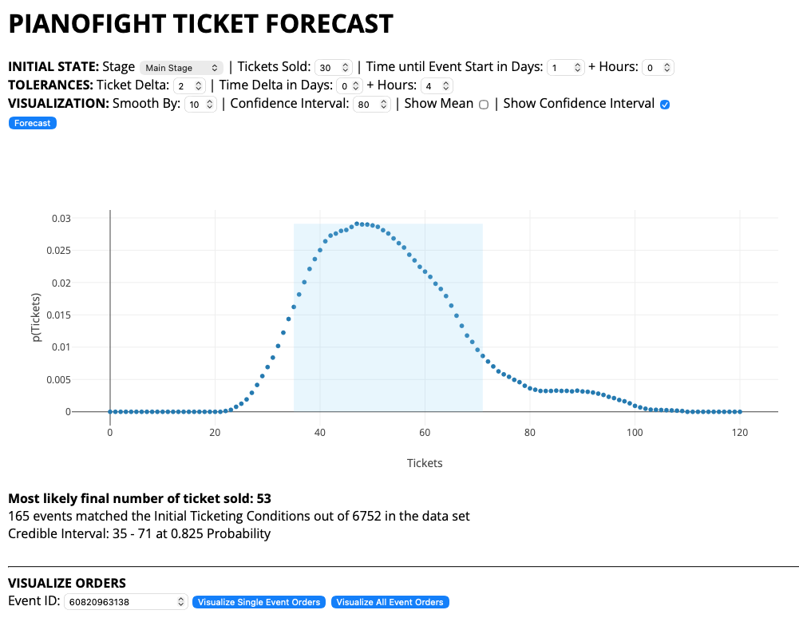

# PianoFight Ticket Forecast


A Bayesian statistical forecasting tool for predicting ticket sales at PianoFight Theater venues.

## Overview

This application uses historical event data from Eventbrite to predict final ticket sales for upcoming shows. By analyzing patterns from past events with similar characteristics (venue, timing, initial sales velocity), it generates probabilistic forecasts with confidence intervals.

## Features

- **Bayesian Probability Model**: Calculates likelihood of various sales outcomes based on historical data
- **Real-time Forecasting**: Projects final ticket sales based on current sales and time until event
- **Interactive Visualizations**: Dynamic plots showing probability distributions and sales trajectories
- **Credible Intervals**: Statistical confidence ranges for predictions
- **Historical Pattern Matching**: Identifies similar past events to improve forecast accuracy
- **Multi-venue Support**: Handles different venue capacities (Main Stage: 120, Second Stage: 60)

## How It Works

### The Forecasting Algorithm

1. **State Definition**: Defines a "state" based on current conditions:
   - Number of tickets sold (with tolerance range)
   - Time until event start (with tolerance range)
   - Venue type

2. **Historical Analysis**: Scans historical events to find matches:
   - Filters for events that passed through the defined state
   - Tracks their final attendance numbers

3. **Bayesian Calculation**: Computes probabilities:
   ```
   P(final_tickets | current_state) = P(current_state | final_tickets) × P(final_tickets) / P(current_state)
   ```

4. **Smoothing**: Applies weighted smoothing to reduce noise in probability distribution

5. **Confidence Intervals**: Calculates credible intervals at specified confidence levels

### Key Parameters

- **Initial Tickets**: Current number of tickets sold
- **Ticket Delta**: Tolerance range for matching similar sales levels (±)
- **Time Until Event**: Days/hours until the event starts
- **Time Delta**: Tolerance range for matching similar timeframes (±)
- **Smooth By**: Smoothing factor for probability distribution
- **Confidence Interval**: Desired confidence level (e.g., 80%)

## Technical Stack

- **Frontend**: Vanilla JavaScript, HTML5, CSS3
- **Data Visualization**: Plotly.js
- **UI Components**: Chosen.js for enhanced select dropdowns
- **Data Source**: Eventbrite API (via JSON exports)
- **Statistical Method**: Bayesian inference

## Data Structure

The application expects JSON data files:
- `events-all.JSON` - All event data from Eventbrite
- `attendees.JSON` - Ticket purchase records
- `venues.JSON` - Venue information
- `reconStats.JSON` - Reconciliation statistics

## Usage

### Basic Forecast

1. Set **Initial State** parameters:
   - Select venue (Main Stage or Second Stage)
   - Enter current tickets sold
   - Enter time until event (days + hours)

2. Adjust **Tolerances**:
   - Ticket Delta: How much variance in ticket counts to include
   - Time Delta: How much variance in timing to include

3. Configure **Visualization**:
   - Smoothing factor
   - Confidence interval percentage
   - Toggle mean line and confidence interval display

4. Click **Forecast** to generate prediction

### Interpreting Results

- **Most Likely Final Tickets**: Expected final attendance (mean of distribution)
- **Credible Interval**: Range where actual result is likely to fall
- **Probability Distribution**: Shows likelihood of each possible outcome
- **Matching Events**: Number of historical events that matched your criteria

### Order Visualization

- Enter an Event ID to see ticket sales over time
- Visualize sales velocity and patterns
- Compare against initial state box to see when conditions were met

## Use Cases at PianoFight

- **Revenue Forecasting**: Predict box office performance early in sales cycle
- **Marketing Decisions**: Identify shows that need promotion boost
- **Capacity Planning**: Optimize staffing and resource allocation
- **Show Selection**: Evaluate potential of different productions
- **Pricing Strategy**: Adjust ticket prices based on demand predictions

## Statistical Approach

### Why Bayesian?

Traditional forecasting methods often assume linear relationships or require extensive feature engineering. The Bayesian approach:
- Allows a reasonable forcast to be generated with minimal data
- Handles uncertainty naturally through probability distributions
- Incorporates historical patterns without overfitting
- Provides interpretable confidence intervals
- Works well with limited data by leveraging similar events

### Key Insights

- Shows with similar initial sales velocities tend to have similar final outcomes
- Time until event is a critical factor (urgency drives late sales)
- Venue capacity creates natural ceiling effects
- Historical patterns from same show/organizer improve predictions

## Development Notes

- Data is cached with random query parameters to bust browser caching
- Unlisted events are automatically filtered out
- Free/refunded/cancelled tickets are excluded from analysis
- Attendee data is sorted by purchase date for temporal analysis

## Future Enhancements

Potential improvements:
- [ ] Add some weight to events within rooms of different capacity --> extend to all capacities
- [ ] Add seasonality factors (day of week, time of year, etc)
- [ ] Allow users to opt in to shar venue data and improve models
- [ ] Real-time API integration instead of cached JSON
- [ ] Machine learning ensemble with traditional time series models
- [ ] Mobile-responsive design
- [ ] Export forecast reports
- [ ] Feed forecast data into staffing application (Ticket Wizard)

## Performance

- Processes 1000+ historical events in real-time
- Sub-second forecast generation
- Interactive visualizations with smooth rendering
- Efficient filtering and probability calculations

## License

Proprietary - Internal tool for PianoFight San Francisco (RIP)

## Author

Built for PianoFight's operations team

markdown## Note on Data Files

This repository contains the application code only. The actual event data files are not included as they contain sensitive business information. To run this application, you would need:

- `events-all.JSON` - Event data from Eventbrite API
- `attendees.JSON` - Ticket purchase records
- `venues.JSON` - Venue configuration
- `reconStats.JSON` - Reconciliation statistics

These files are generated via automated cron jobs that query the Eventbrite API.

---

*This tool demonstrates practical application of Bayesian statistics, data visualization, and real-time analytics for business intelligence in the live entertainment industry.*
